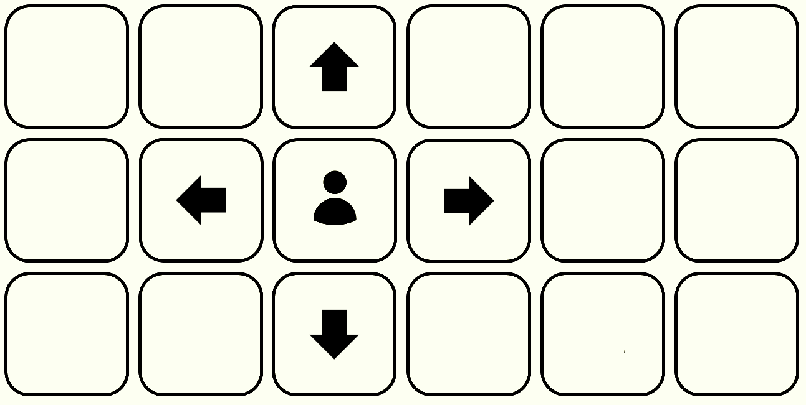
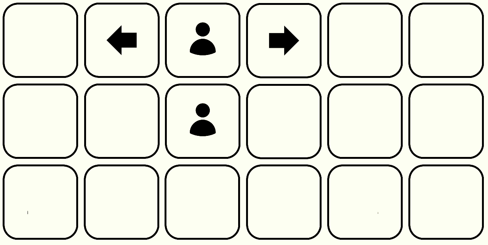

# Simulación check-in Aerolínea

## Como ejecutar la API de manera local

Clonar el proyecto

```bash
$ git clone https://github.com/dariog98/andes-airlines-bsale-api.git
```

Dirigirse al directorio del proyecto

```bash
cd andes-airlines-bsale-api
```

Crear un archivo `.env` en el directorio base con las siguientes variables:

`PORT = portnumber`

`DB_HOST = hostname`

`DB_USER = username`

`DB_PASS = password`

`DB_NAME = dbname`

Ejecutar los siguientes comandos:

```bash
$ npm install
```

```bash
$ npm start
```

## Solución

#### Planteamiento general
Para este ejercicio se ha planteado hacer uso de un algoritmo de búsqueda por vecinos.
Los pasajeros de cada uno de los vuelos, serán previamente separados por grupos mantener la cercanía de los miembros en el avión.
Si dentro de un grupo, un pasajero tiene un asiento, entonces se empezará buscando por los asientos vecinos a ese. En caso de no haberlo, se tomará el primer asiento libre del avión y se comenzará a buscar desde ahí.
El algoritmo prioriza encontrar el grupo de asientos vecinos más grande posible que pueda abarcar a todo el grupo. Si no es posible hallar un conjunto de asientos vecinos para todo el grupo, se procederá a guardar el maximo conjunto de asientos hallados y buscar otro conjunto de asientos que complete el numero restante. Si esto ultimo no es suficiente, se procederá a seleccionar asientos al azar para completar el numero total de asientos necesarios.

#### En caso de haber menores en el grupo
La prioridad en el ejercicio es hallar un asiento al lado de un acompañante mayor para cada menor dentro de un vuelo.
Para facilitar esto a cada vecino que se le encuentra a un asiento se le asigna un peso de uno, si estos son vecinos en otras columnas y un peso de dos, si estos son vecinos en la misma fila.
De manera que, se busca forzosamente hallar un asiento libre que disponga de un vecino libre de peso dos para posicionar al menor al lado de algún acompañante adulto.

#### Asientos Vecinos
Para este ejercicio `asientos vecinos` es todo asiento a la izquierda, derecha, encima y debajo de un asiento que este directamente al lado de otro, de forma que los asientos en una misma fila, pero en columnas muy separadas, no serán tomadas en consideración como vecinos. 



  